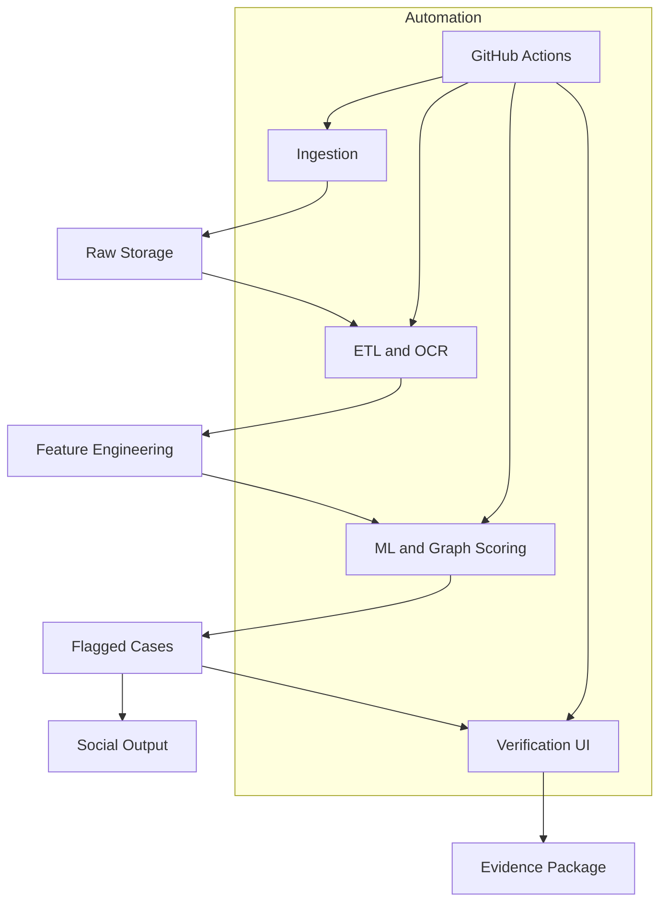

# System Architecture

```mermaid
flowchart TB
    A[Ingestion] --> B[Raw Storage]
    B --> C[ETL and OCR]
    C --> D[Feature Engineering]
    D --> E[ML and Graph Scoring]
    E --> F[Flagged Cases]
    F --> G[Verification UI]
    G --> H[Evidence Package]
    F --> I[Social Output]

    subgraph Automation
      J[GitHub Actions] --> A
      J --> C
      J --> E
      J --> G
    end
```

## Notes
- Core pipelines should emit provenance metadata at each transform step.
- Legal review gates occur before public reporting outputs.
